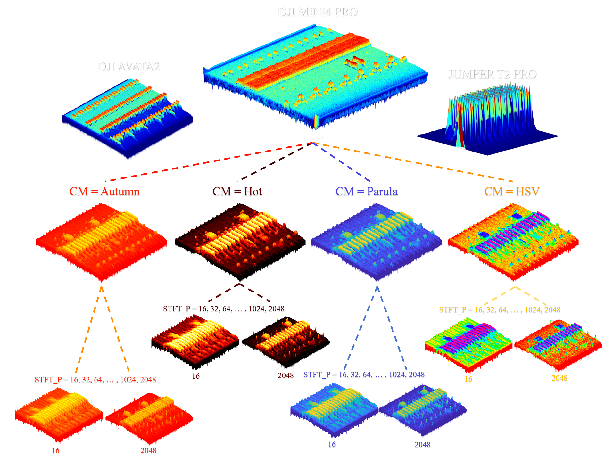
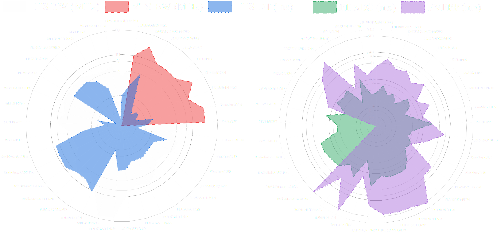

<h1 style="text-align:center;"> The RFUAV DATASET (UNDER REVIWING) </h1>

This project is now under reviewing! Please stay tuned for updates. Thank you for your patience!

## Abstract

The official repository for our paper, *"RFUAV: A Benchmark Dataset for Unmanned Aerial Vehicle Detection and Identification"*, can be accessed here. RFUAV offers a comprehensive benchmark dataset for Radio-Frequency (RF)-based drone detection and identification.
  


In addition to the dataset, we provide the raw data used to generate the spectral information, which includes recordings from 35 different types of drones under high signal-to-noise ratio (SNR) conditions. This dataset is available to all researchers working with RF data for drone analysis. Researchers can apply the deep learning methods we have provided, or use traditional signal processing techniques such as decoding, demodulation, and FFT.

Detailed information about the dataset, including file sizes (total data volume for each drone), SNR (the highest SNR for each dataset), and the middle frequency (the central frequency used during data collection for each drone), is provided in the figure below.

  

We analyzed the properties of each drone in the dataset, including: Frequency Hopping Signal Bandwidth (FHSBW), Frequency Hopping Signal Duration Time (FHSDT), Video Transmitted Signal Bandwidth (VSBW), Frequency Hopping Signal Duty Cycle (FHSDC), and Frequency Hopping Signal Pattern Period (FHSPP). The distributions of these properties are plotted below. More detailed information can be found in our paper.

  

With the RFUAV you can achieve drone signal detect and drone identification on the raw IQ data directly like this:
    <div style="text-align:center;">
        
    </div>

## 1.Quick start
<details>
<summary>Installtion</summary>

    pip install -r requirements.txt

</details>

<details>
<summary>Classify the drone with utils.benchmark </summary>

    python inference.py

</details>
<details>
<summary>Quick train using resnet50 on a small dataset </summary>

    python train.py

</details>

## 2.Usage

### SDR Playback
Since our data was directly collected using USRP devices, it is fully compatible with USRP and GNU Radio for signal replay. You can use our raw data to broadcast signals through radio equipment to achieve your desired outcomes. Additionally, we provide the replay results observed during our experiments using an oscilloscope for reference.
    <div style="text-align:center;">
        
    </div>

### 2.1 How to transform the raw frequency signal data into the spectromgram
#### Python Pipeline
We provide a signal processing pipeline to convert the binary raw frequency signal data into spectrogram format using both MATLAB toolbox and Python.
You can easily use the provided code to visualize the spectrogram of a specific data pack. Note that the argument `'oneside'` controls whether to display the half-plane or full-plane spectrogram.
    
    from utils.benchmark import RawDataProcessor
    
    datapack = 'Your datapack path'
    test = RawDataProcessor()
    test.ShowSpectrogram(data_path=datapack,
                         drone_name='DJ FPV COMBO',
                         sample_rate=100e6,
                         stft_point=2048,
                         duration_time=0.1,
                         oneside=False,
                         Middle_Frequency=2400e6)

You can use the following code to automatically convert the raw frequency signal data into spectrograms and save them as .png images.
    
    from utils.benchmark import RawDataProcessor    

    data_path = 'Your datapack path'
    save_path = 'Your save path'
    simple_rate = 100e6
    test = RawDataProcessor()
    test.DrawandSave(fig_save_path=save_path, file_path=data_path, fs=sample_rate,
                    stft_point=1024, duration_time=0.1)

You can use the `graphic.RawdataProcessor.save_as_video()` function to save the spectrogram as a video. The video format allows for a better observation of...
    
    data_path = 'Your datapack path'
    save_path = 'Your save path'
    save_as_video(datapack=datapack,
                  save_path=save_path,
                  fs=100e6,
                  stft_point=1024,
                  duration_time=0.1,
                  fps=5,)

You can use the `graphic.RawdataProcessor.waterfall_spectrogram()` function to convert the raw data into a spectrogram waterfall video, as shown above. The waterfall video visually displays how the signal evolves over time in the original data.

    data_path = 'Your datapack path'
    save_path = 'Your save path'
    waterfull_video(datapack=datapack,
                    save_path=save_path,
                    fs=100e6,
                    stft_point=1024,
                    duration_time=0.1,
                    fps=5,)

#### Matlab Pipeline

You can simply use the `check.m` program to check the spectromgram of a specialized data pack. 
```MATLAB
data_path = 'Your datapack path';
nfft = 512;
fs = 100e6;
duration_time= 0.1;
datatype = 'float32';
check(data_path,nfft ,fs,duration_time,datatype);
```

### 2.2 How to estimate the SNR

We provide an SNR estimation method using the MATLAB toolbox to help you better analyze the binary raw frequency signal data. Additionally, we offer an SNR adjustment method to add noise to the raw data and adjust it to different SNR levels.

    [idx1,idx2,idx3,idx4,f1, f2] = positionFind(dataIQ, fs, bw, NFFT);
    snr_esti = snrEsti(dataIQ,fs,NFFT,f1,f2,idx1,idx2,idx3,idx4);

We provide an `awgn1` function to adjust the noise level of the raw signal data based on the SNR estimation results mentioned above. The signal-to-noise ratio can be adjusted between -20 dB and 20 dB, with a default step size of 2 dB. You can also define a custom scale if needed.

### 2.3 How to train a custom drone classification model and use it

We provide custom training code for drone identification tasks based on the PyTorch framework. Currently supported models include [ViT](https://arxiv.org/abs/2010.11929), [ResNet](https://arxiv.org/abs/1512.03385), [MobileNet](https://arxiv.org/abs/1704.04861), and [Swin Transformer](https://arxiv.org/abs/2103.14030). You can also customize your own model using the code in `utils.model.base`.

To customize the training, you can create or modify a configuration file with the `.yaml` extension and specify its path in the training code. Additionally, you can adjust the arguments in `utils.trainer.CustomTrainer()` to achieve the desired training setup.
        
        from utils.trainer import CustomTrainer
        
        CustomTrainer(
            model='resnet50',
            train_data_path='Your train data path',
            val_data_path='Your val data path',
            num_classes=23,
            save_path='Your save path',
            weights_path='Your weights path',
            device='cuda:0',
            batch_size=32,
            shuffle=True,
            image_size=224,
            lr=0.0001,).train()

We provide a pipeline for inference, allowing you to run inference on either spectrogram or binary raw frequency data using the following code. When inferring on binary raw frequency data, the results will automatically be packaged into a video with the identification results displayed on the spectrogram. Note that if you want to infer on a binary raw frequency data pack, you must specify a model weight trained on the spectrogram dataset provided by the Python pipeline.

    from utils.trainer import Classify_Model
    
    test = Classify_Model(cfg='Your configration file path',
                          weight_path='Your weights path')

    test.inference(source='Your target data path',
                   save_path='Your target save path')

### 2.4 How to train a custom drone detection model and use it

We provide a custom training method for drone detection tasks. Currently supported models include [YOLOv5](https://github.com/ultralytics/yolov5), [Faster R-CNN](https://arxiv.org/abs/1506.01497) (coming soon), and [DETR](https://arxiv.org/abs/2005.12872) (coming soon).
You can train the YOLOv5 model for drone detection using the following code.

    from utils.trainer import DetTrainer

    model = DetTrainer(model_name='yolo')
    model.train(save_dir='Your target save path')

We provide an inference pipeline that allows you to run your model on either spectrogram or binary raw frequency data using the following code. When inferring on binary raw frequency data, the results will automatically be packaged into a video with the identification results displayed on the spectrogram. Note that if you want to infer on a binary raw frequency data pack, you must specify a model weight trained on the spectrogram dataset provided by the Python pipeline.

    from utils.trainer import Detection_Model

    test = Detection_Model(model_name='yolo', weight_path='Your weights path')
    test.yolov5_detect(source='Your target data path',
                       save_dir='Your target save path')

### 2.6 Classify the drone based on detection result

We provide a simple method to classify drones based on detection results. This involves a two-stage model: the first model detects the drone, and the second model classifies the detected drone signal. You can use the following code to process a raw data pack directly, and the results will be saved as a video.
    
    from utils.trainer import TwoStagesDetector

    cfg_path = '../example/two_stage/sample.json'
    TwoStagesDetector(cfg=cfg_path)

Note that you should specify the configuration file in `.json` format. In the configuration file, you can customize the models used in both the detection and classification stages to achieve better performance.

### 2.6 Evaluate your model on the benchmark

Here’s a more polished version of your sentence:

You can evaluate your model on the benchmark using metrics such as mAP, Top-K Accuracy, F1 score, and the Confusion Matrix. The evaluation will be performed separately on the -20dB to 20dB dataset, and the final model performance will be reported across different signal-to-noise ratios.
    
    from utils.trainer import Classify_Model

    test = Classify_Model(cfg='Your configration file path',
                          weight_path='Your weights path')

    test.benchmark()

### 2.7 Some useful tools to help you to process the dataset

You can directly access our raw data for processing as needed. We provide a MATLAB tool (`tools.rawdata_crop.m`) for segmenting the raw data. You can specify any segment of raw data to be split every 2 seconds. The segmented data packets are smaller and easier to process.

The benchmark includes drone images under various SNRs, while the training set only contains drone image data at its original SNR. Using this training set directly may result in poor model performance on the benchmark. To address this, we provide a data augmentation tool (`utils.preprocessor.data_augmentation`) to enhance the model’s accuracy.
    
    from utils.preprocessor import data_augmentation

    data_path = "Your dataset path"
    output_path = "Your output path"
    method = ['Aug_method1', 'Aug_method2', ...]
    
    data_augmentation(dataset_path=data_path,
                      output_path=output_path,
                      methods=method)

## 3.Notice 
### 3.1 Raw data parameter description
coming soon
### 3.2 Dataset file Structure
Your dataset file structure should be organized as follows, if you are using the provided dataloader.  
Dataset  
├── train  
│ ├── AVATA  
│ │ └── imgs  
│ └── MINI4  
│ &nbsp;&nbsp;&nbsp;&nbsp;└── imgs  
└── valid  
&nbsp;&nbsp;&nbsp;├── AVATA  
&nbsp;&nbsp;&nbsp;│ └── imgs  
&nbsp;&nbsp;&nbsp;└── MINI4  
&nbsp;&nbsp;&nbsp;&nbsp;&nbsp;&nbsp;&nbsp;└── imgs  
## 4.Dataset download
coming soon
## 5.Experiment
coming soon
## Citation
coming soon
